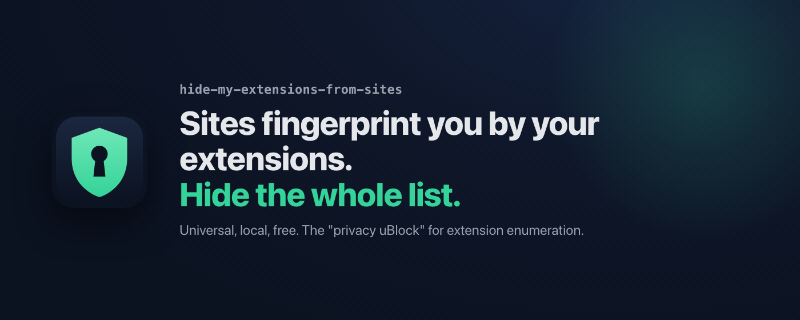
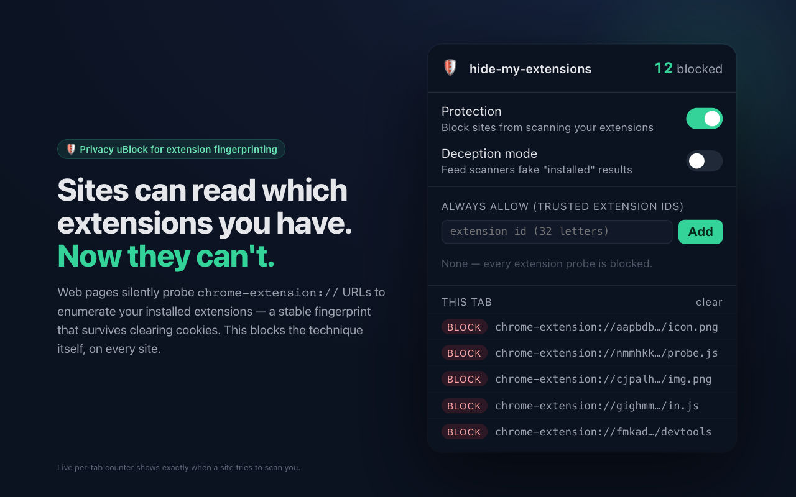
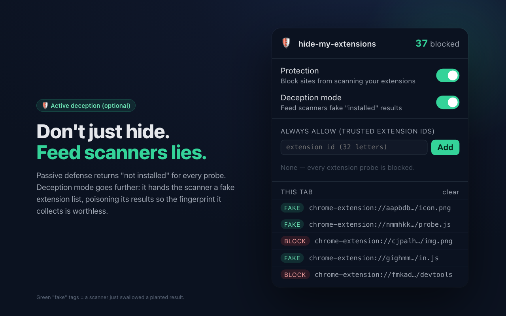

# hide-my-extensions-from-sites 🛡

**[English](../../README.md) ・ [日本語](README.ja.md) ・ [简体中文](README.zh-CN.md) ・ 한국어 ・ [Español](README.es.md) ・ [Français](README.fr.md)**

<p align="center">
  
</p>

**Hide my extensions from every site that scans.**

웹사이트는 *당신이 어떤 브라우저 확장 프로그램을 설치했는지*를 몰래 알아낼 수 있습니다. `chrome-extension://{id}/{resource}` URL을 하나씩 요청하고, 어떤 것이 응답하는지를 보고 설치된 확장 프로그램을 **열거**하는 수법입니다. LinkedIn의 "BrowserGate"로 드러난 바로 그 기법이죠. 이는 강력한 핑거프린팅 신호로, 추적·타게팅·검열에 쓰일 수 있습니다.

`hide-my-extensions-from-sites`는 이 열거를 **모든 사이트에서** 차단합니다. 사이트별 임시방편이 아니라, 기법 그 자체를 막는 "프라이버시판 uBlock"입니다.

> 한 줄로: **당신의 확장 프로그램 목록을 어떤 사이트에서도 보이지 않게 한다.**

---

## 😩 왜 만드나

- **확장 프로그램은 지문이 된다.** 설치된 확장 프로그램의 조합은 쿠키를 지워도 남는 안정적인 식별자가 될 수 있습니다.
- **기존 방어는 너무 국소적이다.** browsergate-shield 같은 도구는 LinkedIn의 특정 ID만 매칭합니다. 같은 기법을 쓰는 다른 사이트에 대한 **범용** 방어가 Chrome에는 없습니다.

---

## 🧱 작동 방식

1. **MAIN world에서 `chrome-extension://` 탐지를 가로챈다** — content_script에서 `fetch` / `XHR` / DOM(`img`/`link` 태그) / Worker / 캐시를 통한 확장 ID 탐지를 가로챕니다.
2. **존재를 숨긴다(수동 방어)** — 탐지에 일률적으로 "없음" 응답을 돌려주어 설치된 확장 프로그램을 읽지 못하게 합니다.
3. **열거를 오염시킨다(능동 기만, 선택 모드)** — 단순히 "없음"을 돌려주는 대신 **가짜 확장 프로그램 목록**을 돌려주어 스캐너의 결과를 오염시킵니다. 수동 방어가 "흘리지 않기"라면, 이쪽은 "거짓을 삼키게 하기"입니다.
4. **작동이 보인다** — 어떤 사이트가 스캔하다 걸리면 아이콘에 배지(예: `🛡 12 scans blocked`)와 실시간 로그가 표시됩니다.

| 수동 방어 — 목록 숨기기 | 기만 모드 — 스캔 오염시키기 |
|:---:|:---:|
|  |  |

---

## 🥊 비교

| | 범위 | 능동 기만 |
|---|---|---|
| browsergate-shield | LinkedIn 전용 | 없음 |
| TrackPrivacy | 범용 | 없음 |
| **hide-my-extensions-from-sites** | **범용(모든 사이트)** | **있음(선택 모드)** |

---

## 🔒 범위

- **계정 없음, 서버 없음, 클라우드 없음.** 모든 것이 브라우저 안에서 로컬로 동작합니다 — 결정적이고, 오프라인이며, 무료입니다.
- **신뢰하는 확장 프로그램 화이트리스트.** 일부 확장 프로그램은 정당하게 페이지에 리소스를 제공합니다. 팝업에서 그 ID를 추가하면 해당 요청은 손대지 않고 통과시킵니다.
- 대상: **Chrome / Chromium**(111+) 및 **Firefox**(140+), Manifest V3.

---

## 🎯 위협 모델과 커버리지

공격자는 `chrome-extension://{id}/{resource}`(또는 `moz-extension://…`) URL을 요청하고 어떤 것이 해석되는지를 관찰하여, 당신이 어떤 확장 프로그램을 설치했는지 알아내려는 **웹 페이지**입니다. 우리는 페이지의 MAIN world에서 `document_start` 시점에, 어떤 페이지 스크립트보다도 먼저 실행되어, 페이지가 그런 탐지를 발생시키거나 관찰하는 데 쓸 수 있는 모든 요청 채널을 무력화합니다.

**차단된 탐지 벡터**(각각 회귀 테스트가 있음):

| 채널 | 무력화 방식 |
|---|---|
| `fetch()` | 확장 URL 탐지를 거부(기만 모드에서는 가짜 응답) |
| `XMLHttpRequest` | 확장 URL로의 `open()`을 죽은 URL로 리다이렉트 |
| `` / `<script>` / `<link>`의 `src`/`href` | 속성 setter와 `setAttribute`를 재작성 |
| `<iframe>` / `<object>` / `<embed>` | `src` / `data` setter와 `setAttribute`를 재작성 |
| `srcset`(`` / `<source>`) | setter와 `setAttribute`를 재작성 |
| SVG `<use>`의 `xlink:href` | `setAttributeNS`(네임스페이스 포함)를 재작성 |
| CSS `url(extension://…)` | `setProperty` / `cssText` / `setAttribute("style")`를 정화 |
| `navigator.sendBeacon` | 확장 URL을 향한 beacon을 폐기 |
| `EventSource` | 확장 URL을 향한 스트림을 죽은 URL로 리다이렉트 |

**신뢰 경계.** ISOLATED world 브리지는 어떤 페이지 스크립트가 실행되기 전에 MAIN world에 로드마다 고유한 nonce를 건넵니다. 모든 설정 업데이트는 이 nonce를 지녀야 하고, 동일 출처(`'/'`) 채널로 전달되어야 합니다. 따라서 악성 페이지는 **방어를 끄는 메시지를 위조할 수 없고**, nonce를 엿볼 수도 없습니다.

**알려진 한계(의도된 설계이며 문서화됨):**

- **`el.style.backgroundImage = …`**(직접 camelCase 속성)는 Chrome에서 *네이티브 명명 setter*입니다 — `CSSStyleDeclaration.prototype`에 없으므로 패치할 수 없습니다. 또한 CSS는 load/error 신호를 주지 않아 열거 오라클로는 빈약합니다. 위의 문자열 기반 CSS 경로는 *이미 커버*됩니다.
- **타이밍 오라클**(`onload`/`onerror` 지연 차이)은 정규화되지 않았습니다 — 이는 단일 패치가 아니라 설계가 필요하며 1.0의 범위 밖입니다.
- **Firefox-for-Android**용 `web-ext` lint 경고 하나(데이터 수집 키 하한); 본 빌드는 데스크톱을 대상으로 합니다.

**설정 schema(v1에서 동결).** 저장되는 설정은 정확히 `{ schemaVersion, enabled, deception, allowlist }`입니다. 로드 시 이 형태로 마이그레이션됩니다: `enabled`는 페일세이프이고(불리언이 아닌 값은 무엇이든 **방어 켜짐**을 뜻함), `deception`은 엄격한 명시적 활성화이며, `allowlist`는 소문자 32자 ID로 검증됩니다. 오래되었거나 손상된 설정은 제자리에서 멱등하게 업그레이드됩니다.

---

## 📦 설치(로컬 로드)

아직 스토어 등록은 없습니다 — 압축을 푼 상태로 실행하세요. `npm run build`는 `dist/`에 두 개의 zip을 만듭니다: `…-chrome-<version>.zip`과 `…-firefox-<version>.zip`. 둘은 동일한 코드를 공유하며 manifest만 다릅니다(Firefox는 event-page 백그라운드를 쓰고 데이터 수집이 없다고 선언).

**Chrome / Chromium(111+):**

1. Chrome 폴더를 준비합니다(저장소를 클론하거나 `…-chrome-<version>.zip`을 풉니다).
2. `chrome://extensions`를 열고 오른쪽 위의 **개발자 모드**를 켭니다.
3. **압축해제된 확장 프로그램을 로드합니다**를 클릭하고 `manifest.json`이 들어 있는 폴더를 고릅니다.

**Firefox(140+):**

1. `…-firefox-<version>.zip`을 풉니다.
2. `about:debugging#/runtime/this-firefox`를 엽니다.
3. **임시 부가 기능 로드…**를 클릭하고 그 안의 `manifest.json`을 고릅니다.

어느 쪽이든 🛡 아이콘이 툴바에 나타납니다 — 클릭하면 방어를 토글하고 탭별 스캔 횟수를 볼 수 있습니다.

> `.zip`은 바로 설치할 수 없습니다 — 먼저 압축을 푸세요. Firefox는 140+, Chrome/Chromium은 111+가 필요합니다(둘 다 MAIN-world content script 때문).

## 🧪 개발과 테스트

```sh
npm install
npm test            # 단위 + 통합(vitest + jsdom)
npm run test:e2e    # 시스템 테스트(Playwright; 처음 한 번 `npx playwright install chromium` 실행)
npm run build       # dist/에 로드 가능한 zip 생성
```

테스트는 계층적입니다: 단위 + 통합(`tests/`)은 vitest로 돌고, E2E 테스트는 Chromium에서 실제 압축해제된 확장을 로드합니다. Firefox 빌드의 manifest는 `tools/firefox-manifest.js`가 Chrome 버전에서 생성하며(단일 사실 출처), `web-ext lint`로 검증합니다.

## 🚧 상태

**v1.0 — 안정.** 설정 schema는 동결되었고(제자리 마이그레이션 포함), 차단된 벡터는 위에 문서화되어 있으며 각각 회귀 테스트가 있습니다(단위 + 통합 + Chromium E2E). 로컬 "압축해제된 확장 로드 / 임시 부가 기능 로드" zip으로 배포됩니다. 아직 Chrome Web Store나 Firefox Add-ons에는 등록되지 않았습니다.

## 📄 라이선스

MIT
